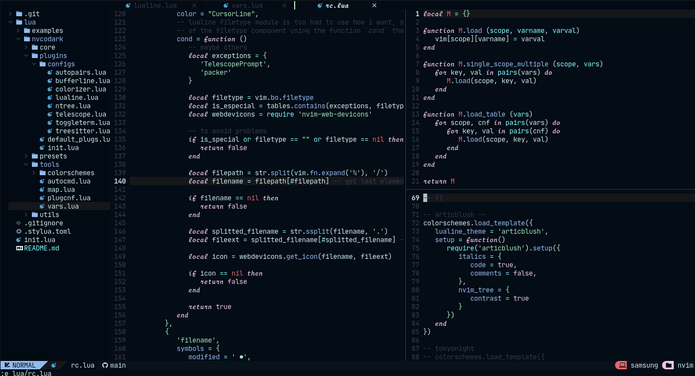

<h2 align="center">Articblush Neovim Theme</h2> 
 <h3 align="center"> A cold & comfy theme for Neovim using articblush!
   
 
 ----

This is a port of [Articblush Colorscheme](https://github.com/articblush) for Neovim using lua as backend for this.



## External plugins support

- Telescope
- Nvim Tree
- Tresitter
- Lsp
- Lsp saga
- Coc
- Bufferline
- Illuminate
- Diff
- Git signs
- Git gutter
- Lualine
- Ident-BlankLine

## Installation

You can use packer or vim-plug.

### Packer

Put this in your packer config:

```lua
use {'articblush/articblush.nvim', as = 'articblush'}
```

Then execute `:PackerInstall` or `:PackerSync` to install articblush :3

### Vim plug

Put this in your config

```vim
Plug 'articblush/articblush.nvim', { 'as': 'articblush' }
```

### Enable the theme

You can use the following lua code to enable it:

```lua
local present, articblush = pcall(require, 'articblush')

if not present then
  error('Can\'t import articblush, make sure you installed it! :v')
end

articblush.setup({
  nvim_tree = {
    contrast = true, -- or false to disable tree contrast
  },
})
```

or if you want a more simple example:

```lua
require('articblush').setup({
  nvim_tree = {
    contrast = true, -- or false to disable tree contrast
  },
})
```

You can enable italics too!

```lua
require('articblush').setup({
  italics = {
    code = true,
    comments = false -- to disable italic comments, replace to true to enable
  },
  nvim_tree = {
    contrast = true
  }
})
```

Or with vim script if you want (not able the posibility to disable tree contrast, or enable italics)

```vim
colorscheme articblush
```

If you want to have the possibility to setup that options using vim script, use the next snippet as reference

```vim
lua << EOF
require('articblush').setup({
  italics = {
    code = true,
    comments = false,
  },
  nvim_tree = {
    contrast = true
  }
})
EOF
```

## Lualine

This articblush port has lualine integration, too - enable it! (if you use lualine lmao)

```lua
require('lualine').setup {
  options = {
    theme = 'articblush',
    -- <SNIP>
  },
  -- <SNIP>
}
```

## Getting the colors

You can get the colors of articblush using the articblush-lua based API!

```lua
local colors = require('articblush.core').get_colors()

print(colors.background)
```

> If `background` is `light`, `articblush.core.get_colors` will return the light articblush palette
